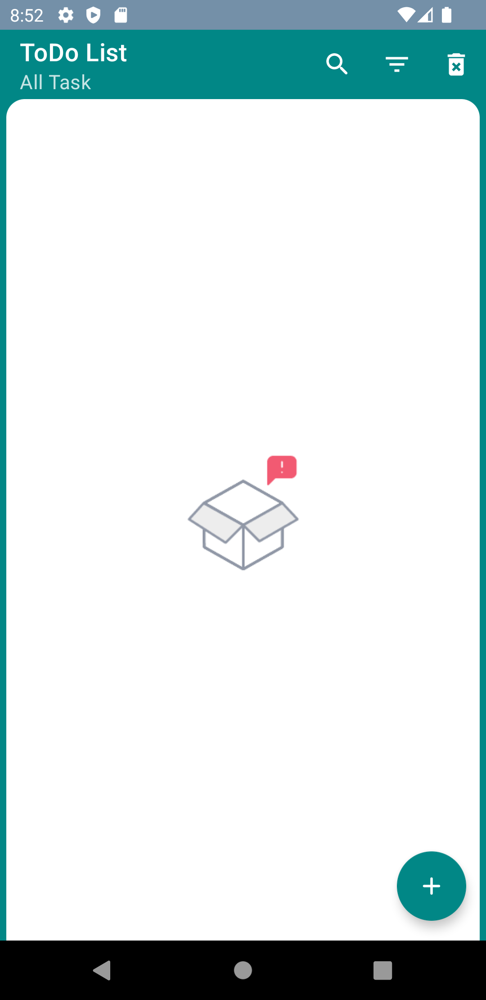
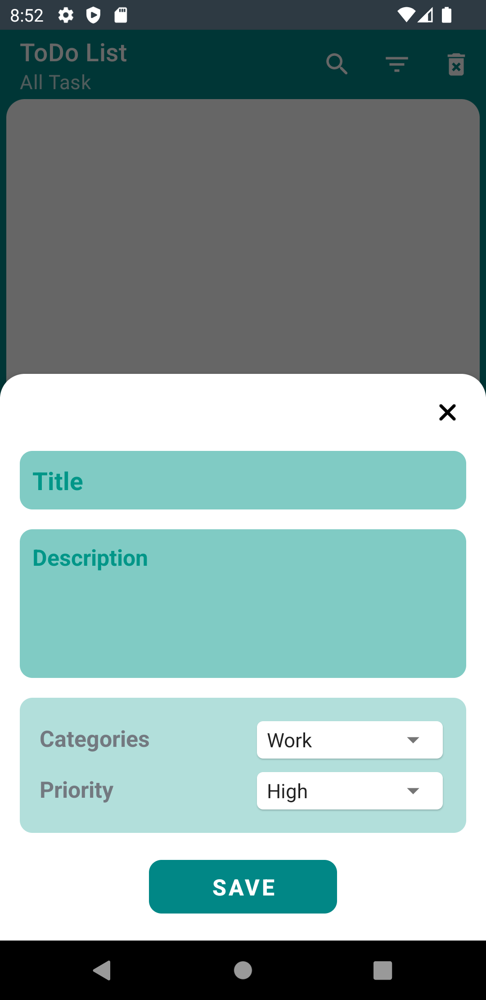
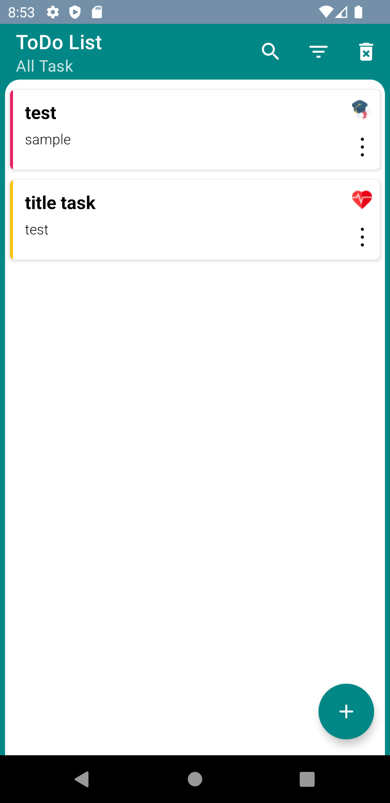
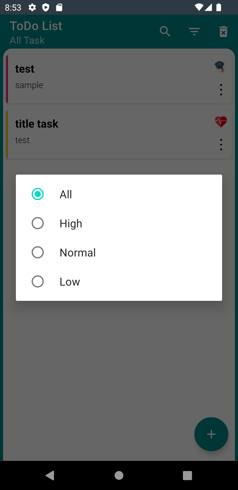
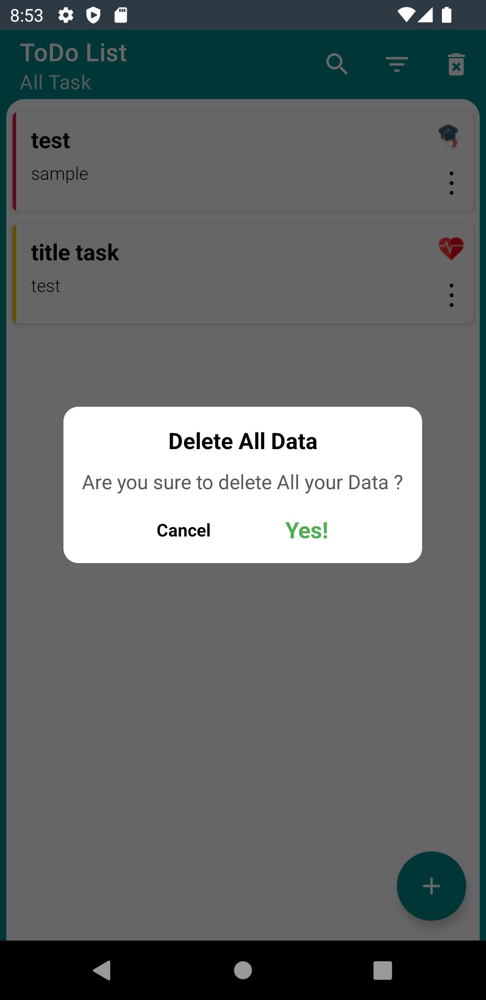

# SimpleTaskApp-MVVM

Overview :
 
The purpose of this project series is to teach different architectures with different structures, and you can check these architectures and structures.

This project in
- MVP architecture : https://github.com/ezatpanah/SimpleTaskApp-MVP [ Room Database - View Binding - Dagger Hilt - RxJava - Lottie]
- MVVM architecture : Current Repo
- MVI architecture : Coming soon

The app was written in Kotlin.

 
Technologies and Libraries Used :

- Room Database
- LiveData
- Flow
- Coroutines
- Dagger Hilt
- ViewModel
- Lottie
- View Binding

Screen-Shot :
 
Screen-Shot :
 
    
