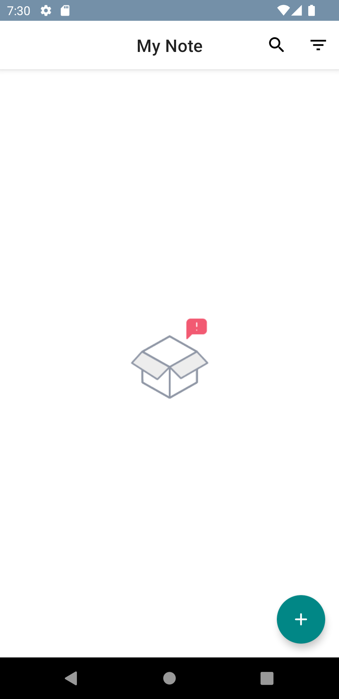
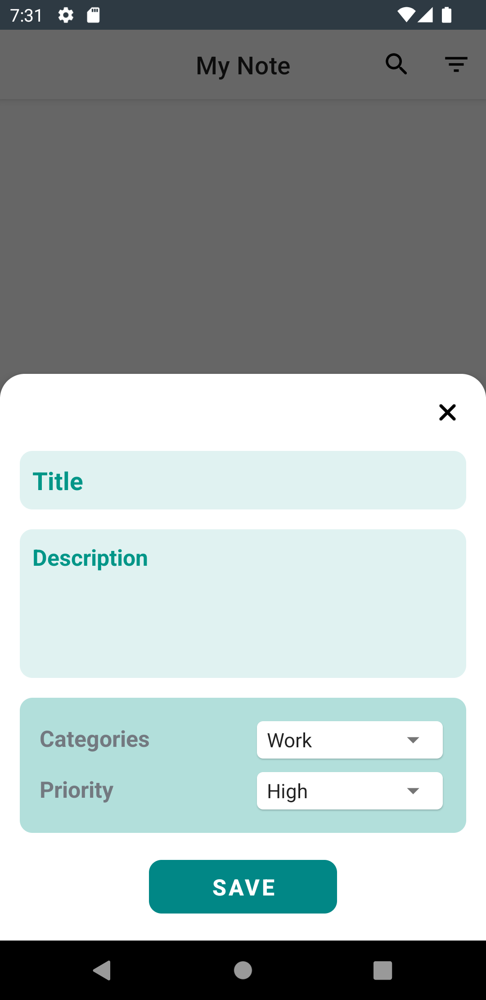
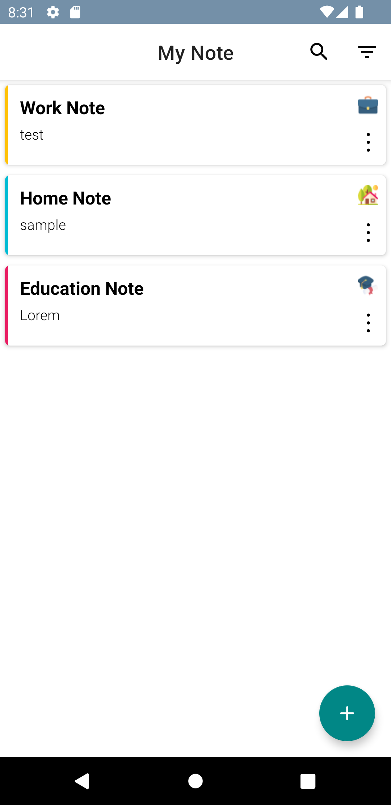
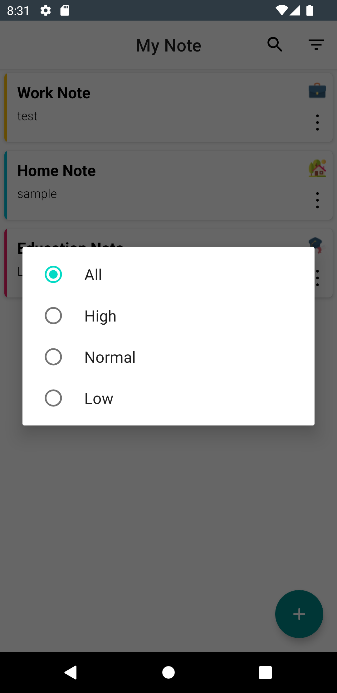
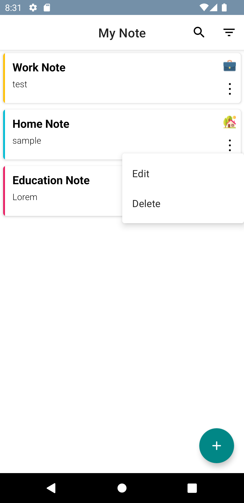

# SimpleNoteApp-MVVM

Overview :

...

The app was written in Kotlin.

 
Technologies and Libraries Used :

- Room Database
- LiveData
- Flow
- Coroutines
- Dagger Hilt
- ViewModel
- Lottie
- View Binding

Screen-Shot :
 
    
